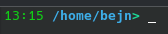

# 5.B Dodatan softver
***Softver opšte ili specifične namene koji možda želite a možda i ne.***

## Opšti alat za Plasmu
***Opcioni dodatani alat čiji ekvivalenti dolaze uz Windows***
- `ark` - Menadžer arhiva
- `kclock` - Tajmer, štoperica, itd.
- `gwenview` - Pregledač slika
- `okular` - Pregledač PDF-ova
- `kamoso` - Kamera
- `spectacle` - Screenshot alat (Po uzoru na "Snipping Tool" iz Windowsa)
- `kate` - GUI tekst editor
- `qalculate-gtk` - Kalkulator (`kcalc` ne valja...)
- `kolourpaint` - Paint (Po uzoru na "Paint" iz Windows XP i ranije)
- `gparted` - GUI menadžer diskova i particija
- `kweather` - Vremenska prognoza

```sh
sudo pacman -S ark kclock gwenview okular kamoso spectacle kate qalculate-gtk kolourpaint gparted kweather
```

## Web pregledač
Odabrati i instalirati željeni web pregledač, navešću najpopularnije:
- `firefox`
- `chromium`
- `google-chrome` (AUR)
- `vivaldi`
- `brave` (AUR)

> ℹ️ **Za uputstvo za instalaciju AUR paketa pogledati `3-upravljanje_paketima.md`, odeljak *"Arch user repository (AUR)"***

## Microsoft fontovi
***Standardni microsoft fontovi (Arial, Times New Roman, Comic Sans, itd.)***  
***Potpuno opciono ali neke aplikacije će izgledati prirodnije.***

Nalazi se na AUR-u:
- **Naziv paketa**: `ttf-ms-fonts`
- **Git clone url:** https://aur.archlinux.org/ttf-ms-fonts.git

## Screen share
***Ukoliko želite da "delite ekran" preko Discord-a, Zoom-a, itd. neophodan je `xwaylandvideobridge` AUR paket.***

- **Naziv paketa**: `xwaylandvideobridge`
- **Git clone url:** https://aur.archlinux.org/xwaylandvideobridge.git

> ⚠️ "Streamovanje" video igara na Discordu daje varirajuće performanse - **uglavnom je neupotrebljivo**!  
> ⚠️ Trenutno nažalost ne postoji rešenje/alternativa za ovaj problem.

## Media player
Postoji gomila - navešću dva:

- `vlc` - popularan GUI player, dostupan i za Windows
    - `vlc-plugins-all` - Neophodan paket sa kodecima
- `mpv` - CLI player, ne preterano user-friendly ali veoma lightweight
    - Obratiti se zvaničnoj dokumentaciji za upotrebu: https://mpv.io/manual/stable/

Ako je potrebno nešto više prilagođeno muzici:
- `elisa` - lep GUI music player

## Office paket
Dve opcije su:

- `libreoffice-fresh` - veoma dobar office paket - može sve što i najnovije verzije Microsoft Office-a
    - Ume biti malo nezgrapan za upotrebu, pogotovo ako ste navikli na moderan MS Office (UI LibreOffice-a podseća na MS Office 2003)
- Korisćenje nekih od web aplikacija (Microsoft 365, Google Docs, etc...)
> ℹ️ Moderne verzije MS Office-a su previše duboko integrisane sa raznim komponentama Windows-a - **neće raditi na Linuksu preko `wine`-a!**  

## Bolji shell (`zsh`)
```sh
sudo pacman -S zsh
```

Promena default shell-a:
```
chsh -s $(which zsh)
```

Pri prvom pokretanju, pratite uputstvo na ekranu za konfiguraciju `zsh`-a.  

Za lepši prompt i obojeni prikaz defaultnih linux alata, dodati u `~/.zhsrc`:
```
PROMPT='%F{green}%T%f %B%F{lightblue}%d%f%F{green}>%f%b '

alias ls='ls --color=auto'
alias dir='dir --color=auto'
alias vdir='vdir --color=auto'
alias grep='grep --color=auto'
alias fgrep='fgrep --color=auto'
alias egrep='egrep --color=auto'
```



## Dropdown terminal (`yakuake`)
***Veoma korisno ako često koristite terminal.***
```sh
sudo pacman -S yakuake
```
Keyboard shortcut:
- System Settings ➡️ Keyboard ➡️ Shortcuts ➡️ Yakuake ➡️ Add...
    - Ja koristim `WIN+q`

Autostart:
- System Settings ➡️ Autostart ➡️ Add New ➡️ Application... ➡️ System ➡️ Yakuake

## Discord
**Preporučujem korišćenje flathub paketa**, zbog toga što je on jedini zvanično verifikovan i održavan od strane Discord developera.  
> ℹ️ **Za uputstvo za instalaciju `flathub` paketa pogledati `5A-dodatni_izvori_softvera.md`**

> ⚠️ Zbog flatpak sandbox-a, "rich presense" funkcionalnost (prikaz trenutno pokrenute igre) neće raditi.  
> ⚠️ Ako vam je to neophodno, instalirajte `discord` paket preko pacman-a. 

```sh
flatpak install com.discordapp.Discord
```

## Ostalo
***Ostale aplikacije koje ja koristim***

- Telegram: `telegram-desktop`
- Viber: `com.viber.Viber` (flathub)
- Spotify: `spotify-launcher`
- KeePassXC: `keepassxc` 
- Visual Studio Code: `visual-studio-code-bin` (AUR)
- btop: `btop` 
- Steam, Lutris, RetroArch, itd.
    - Videti dokument `7-gejming.md`